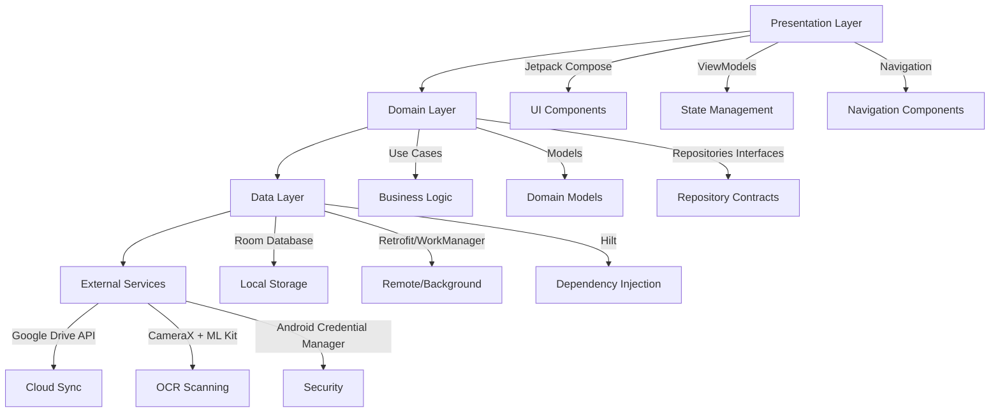
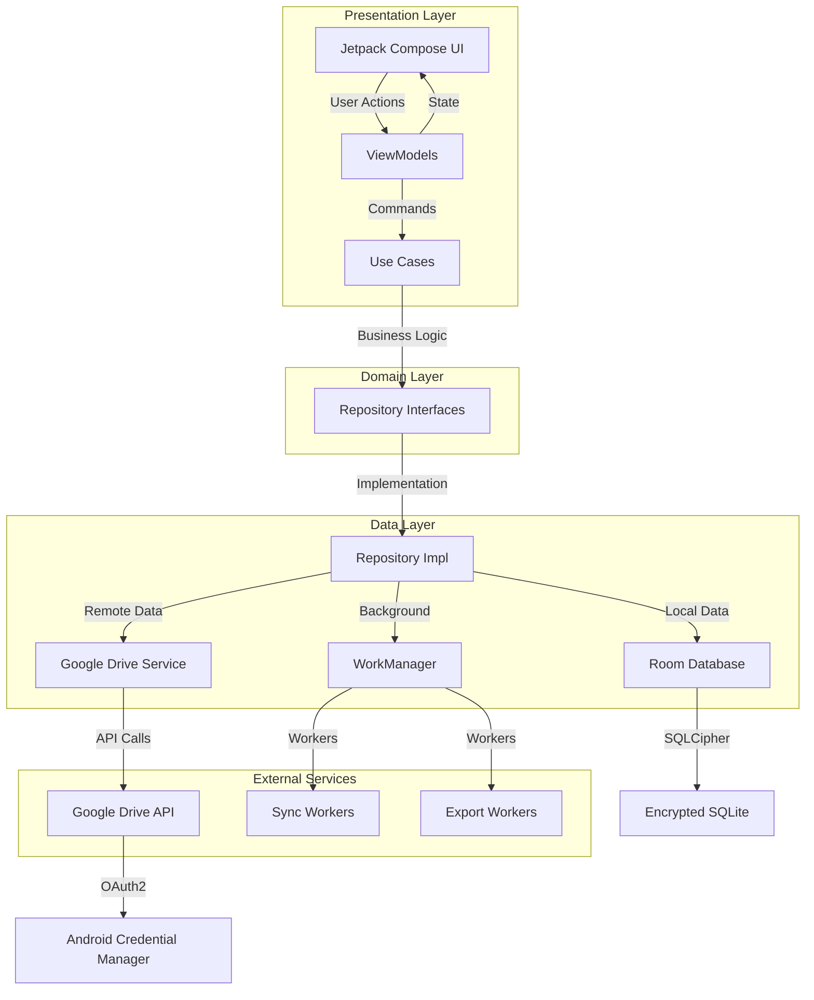
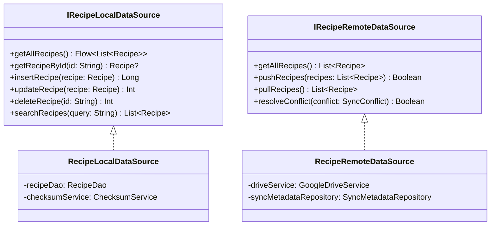
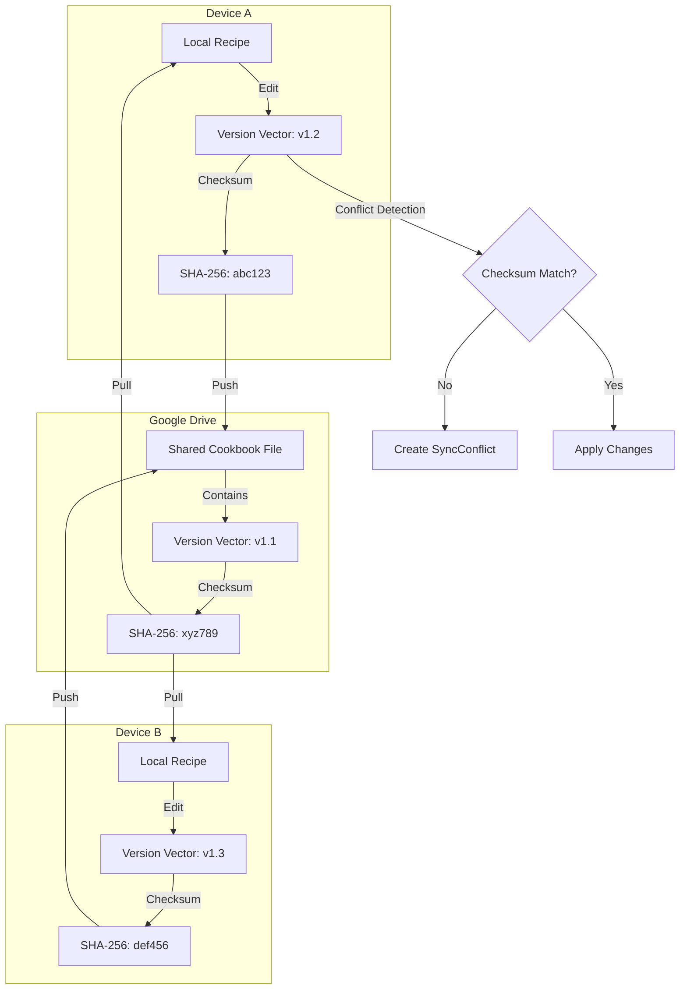
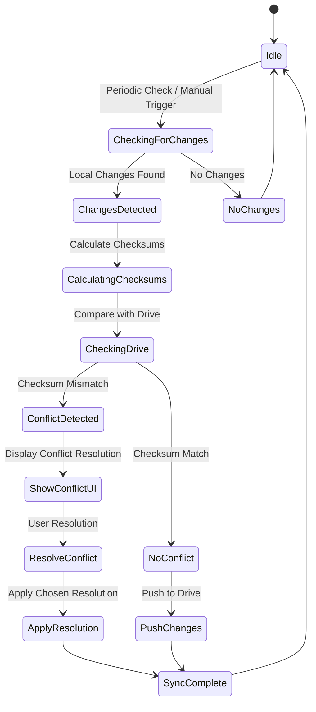
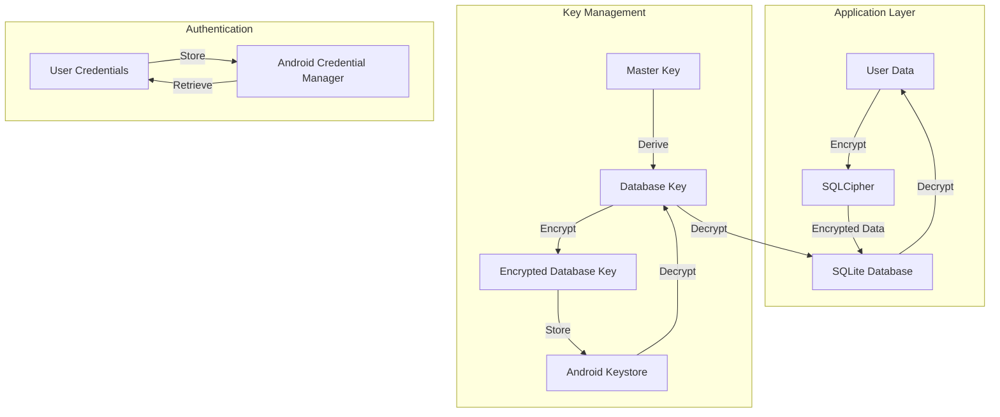
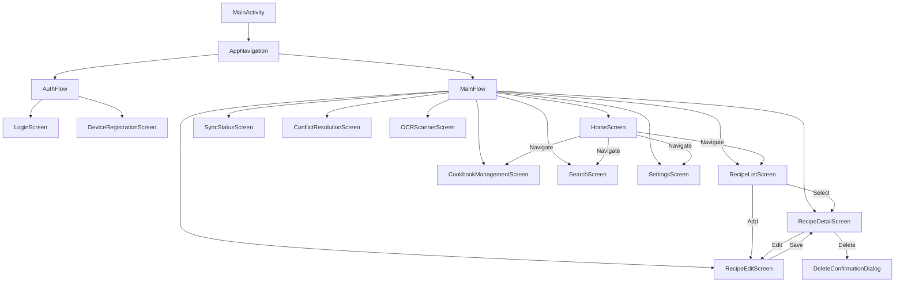
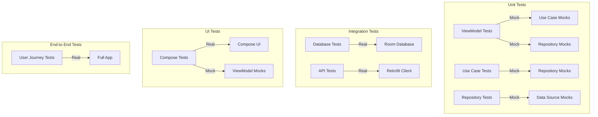

# Cookbook Android - Technical Architecture

## 🏗️ System Overview

**Project**: Our Cookbook Android App  
**Version**: 1.0.0  
**Architecture**: MVVM with Clean Architecture  
**Target**: Android 8.0+ (API 26+), Chromebooks

## 📐 Architecture Layers



## 🗂️ Module Structure

```
Our Cookbook/
├── app/
│   ├── build.gradle
│   ├── src/
│   │   ├── main/
│   │   │   ├── AndroidManifest.xml
│   │   │   ├── java/com/ourcookbook/
│   │   │   │   ├── data/
│   │   │   │   │   ├── model/          # Entity classes
│   │   │   │   │   ├── repository/     # Repository implementations
│   │   │   │   │   ├── datasource/     # Data sources (local/remote)
│   │   │   │   │   ├── db/            # Database classes
│   │   │   │   │   └── di/             # Data layer DI modules
│   │   │   │   ├── domain/
│   │   │   │   │   ├── model/          # Domain models
│   │   │   │   │   ├── repository/     # Repository interfaces
│   │   │   │   │   ├── usecase/        # Use cases
│   │   │   │   │   └── utils/          # Domain utilities
│   │   │   │   ├── ui/
│   │   │   │   │   ├── theme/          # Theme and styling
│   │   │   │   │   ├── components/     # Reusable UI components
│   │   │   │   │   ├── screens/        # Screen implementations
│   │   │   │   │   ├── navigation/     # Navigation components
│   │   │   │   │   └── viewmodel/     # ViewModels
│   │   │   │   └── utils/              # Utility classes
│   │   │   └── assets/
│   │   └── test/                       # Test classes
│   └── build/
├── build.gradle (project)
├── settings.gradle
└── gradle.properties
```

## 🔄 Data Flow Architecture



## 🗃️ Data Layer Architecture

### Repository Pattern Implementation

```kotlin
// Domain Layer - Repository Interface
interface RecipeRepository {
    suspend fun getAllRecipes(): Flow<List<Recipe>>
    suspend fun getRecipeById(id: String): Recipe?
    suspend fun createRecipe(recipe: Recipe): String
    suspend fun updateRecipe(recipe: Recipe)
    suspend fun deleteRecipe(id: String)
    suspend fun searchRecipes(query: String): List<Recipe>
    suspend fun getRecipesByCategory(category: String): List<Recipe>
    suspend fun getFavorites(): List<Recipe>
    // ... other operations
}

// Data Layer - Repository Implementation
class RecipeRepositoryImpl @Inject constructor(
    private val localDataSource: RecipeLocalDataSource,
    private val remoteDataSource: RecipeRemoteDataSource,
    private val checksumService: ChecksumService,
    private val syncService: SyncService
) : RecipeRepository {
    // Implementation with local-first, sync-aware logic
}
```

### Data Source Separation



## 🔐 Sync System Architecture

### Conflict-Free Replicated Data Types (CRDT) Approach



### Sync Process Flow



### Version Vector Implementation

```kotlin
data class VersionVector(
    val deviceId: String,
    val counter: Int,
    val timestamp: Instant
) {
    fun increment(): VersionVector = copy(counter = counter + 1, timestamp = Instant.now())
    
    fun isNewerThan(other: VersionVector): Boolean {
        return when {
            counter > other.counter -> true
            counter < other.counter -> false
            else -> timestamp > other.timestamp
        }
    }
}

// For tracking changes across multiple devices
data class SyncVersionVector(
    val versions: Map<String, VersionVector> // deviceId -> VersionVector
) {
    fun merge(other: SyncVersionVector): SyncVersionVector {
        val merged = mutableMapOf<String, VersionVector>()
        (versions.keys + other.versions.keys).forEach { deviceId ->
            val local = versions[deviceId]
            val remote = other.versions[deviceId]
            merged[deviceId] = when {
                local == null -> remote!!
                remote == null -> local
                else -> if (local.isNewerThan(remote)) local else remote
            }
        }
        return copy(versions = merged)
    }
}
```

## 🛡️ Security Architecture

### Encryption Strategy



### Security Components

```kotlin
// Database encryption configuration
@Module
@InstallIn(SingletonComponent::class)
object DatabaseModule {
    @Provides
    @Singleton
    fun provideEncryptedDatabase(
        @ApplicationContext context: Context,
        passphrase: String
    ): AppDatabase {
        val factory = SupportFactory(passphrase.byteArray())
        return Room.databaseBuilder(
            context,
            AppDatabase::class.java,
            "cookbook-db"
        ).openHelperFactory(factory)
         .build()
    }
}

// Secure credential storage
class SecureCredentialManager(
    private val credentialManager: CredentialManager
) {
    suspend fun saveCredentials(credentials: DriveCredentials) {
        val request = PublicKeyCredentialRequestOptions.Builder()
            .setPublicKeyCredentialRequestOptions(
                PublicKeyCredentialRequestOptions(
                    challenge = generateChallenge(),
                    rpId = "ourcookbook.com",
                    allowCredentials = null,
                    timeoutMillis = 60000
                )
            )
            .build()
        // Store encrypted credentials
    }
}
```

## 🎨 UI Architecture (Jetpack Compose)

### Screen Hierarchy



### Compose State Management

```kotlin
// Base ViewModel with state management
abstract class BaseViewModel<State, Event, Action> : ViewModel() {
    private val _state = MutableStateFlow(initialState())
    val state: StateFlow<State> = _state.asStateFlow()
    
    private val _actions = MutableSharedFlow<Action>()
    val actions: SharedFlow<Action> = _actions.asSharedFlow()
    
    abstract fun initialState(): State
    abstract fun handleEvent(event: Event)
    
    protected fun updateState(reducer: State.() -> State) {
        _state.update { it.reducer() }
    }
    
    protected suspend fun sendAction(action: Action) {
        _actions.emit(action)
    }
}

// Example: RecipeListViewModel
class RecipeListViewModel @Inject constructor(
    private val getRecipes: GetRecipes,
    private val searchRecipes: SearchRecipes,
    private val deleteRecipe: DeleteRecipe
) : BaseViewModel<RecipeListState, RecipeListEvent, RecipeListAction>() {
    
    override fun initialState(): RecipeListState = RecipeListState.Loading
    
    override fun handleEvent(event: RecipeListEvent) {
        when (event) {
            is RecipeListEvent.LoadRecipes -> loadRecipes()
            is RecipeListEvent.Search -> search(event.query)
            is RecipeListEvent.DeleteRecipe -> deleteRecipe(event.recipeId)
        }
    }
    
    private fun loadRecipes() {
        viewModelScope.launch {
            updateState { RecipeListState.Loading }
            getRecipes().collect { result ->
                when (result) {
                    is Result.Success -> updateState { RecipeListState.Success(result.data) }
                    is Result.Error -> updateState { RecipeListState.Error(result.error) }
                }
            }
        }
    }
}
```

### Navigation Architecture

```kotlin
// Navigation routes
object Route {
    const val HOME = "home"
    const val RECIPE_LIST = "recipe_list"
    const val RECIPE_DETAIL = "recipe_detail/{recipeId}"
    const val RECIPE_EDIT = "recipe_edit/{recipeId}"
    const val RECIPE_CREATE = "recipe_create"
    const val COOKBOOK_MANAGEMENT = "cookbook_management"
    const val SEARCH = "search"
    const val SETTINGS = "settings"
    const val SYNC_STATUS = "sync_status"
    const val CONFLICT_RESOLUTION = "conflict_resolution/{conflictId}"
    const val OCR_SCANNER = "ocr_scanner"
    const val AUTH = "auth"
    const val DEVICE_REGISTRATION = "device_registration"
}

// Navigation graph
@Composable
fun AppNavigation(
    navController: NavHostController,
    viewModel: AppViewModel = hiltViewModel()
) {
    NavHost(
        navController = navController,
        startDestination = Route.AUTH
    ) {
        composable(Route.AUTH) { AuthScreen(navController) }
        composable(Route.DEVICE_REGISTRATION) { DeviceRegistrationScreen(navController) }
        composable(Route.HOME) { HomeScreen(navController) }
        composable(Route.RECIPE_LIST) { RecipeListScreen(navController) }
        composable(
            route = Route.RECIPE_DETAIL,
            arguments = listOf(navArgument("recipeId") { type = NavType.StringType })
        ) { backStackEntry ->
            val recipeId = backStackEntry.arguments?.getString("recipeId")
            RecipeDetailScreen(recipeId, navController)
        }
        // ... other destinations
    }
}
```

## 🔧 Dependency Injection (Hilt)

### Module Structure

```kotlin
// AppModule.kt - Application-level dependencies
@Module
@InstallIn(SingletonComponent::class)
object AppModule {
    @Provides
    @Singleton
    fun provideContext(@ApplicationContext context: Context): Context = context
    
    @Provides
    @Singleton
    fun provideDispatcher(): CoroutineDispatcher = Dispatchers.IO
    
    @Provides
    @Singleton
    fun provideChecksumService(): ChecksumService = ChecksumServiceImpl()
    
    @Provides
    @Singleton
    fun provideSyncService(
        localDataSource: RecipeLocalDataSource,
        remoteDataSource: RecipeRemoteDataSource,
        checksumService: ChecksumService
    ): SyncService = SyncServiceImpl(localDataSource, remoteDataSource, checksumService)
}

// DatabaseModule.kt
@Module
@InstallIn(SingletonComponent::class)
object DatabaseModule {
    @Provides
    @Singleton
    fun provideDatabase(
        @ApplicationContext context: Context,
        @DatabasePassphrase passphrase: String
    ): AppDatabase {
        val factory = SupportFactory(passphrase.byteArray())
        return Room.databaseBuilder(
            context,
            AppDatabase::class.java,
            "cookbook-db"
        ).openHelperFactory(factory)
         .addMigrations(MIGRATION_1_2)
         .build()
    }
    
    @Provides
    @Singleton
    fun provideRecipeDao(database: AppDatabase): RecipeDao = database.recipeDao()
    
    @Provides
    @Singleton
    fun provideIngredientDao(database: AppDatabase): IngredientDao = database.ingredientDao()
    // ... other DAOs
}

// RepositoryModule.kt
@Module
@InstallIn(SingletonComponent::class)
object RepositoryModule {
    @Provides
    @Singleton
    fun provideRecipeRepository(
        localDataSource: RecipeLocalDataSource,
        remoteDataSource: RecipeRemoteDataSource,
        syncService: SyncService
    ): RecipeRepository = RecipeRepositoryImpl(localDataSource, remoteDataSource, syncService)
    
    // ... other repositories
}

// UseCaseModule.kt
@Module
@InstallIn(SingletonComponent::class)
object UseCaseModule {
    @Provides
    @Singleton
    fun provideGetRecipes(repository: RecipeRepository): GetRecipes = GetRecipes(repository)
    
    @Provides
    @Singleton
    fun provideSearchRecipes(repository: RecipeRepository): SearchRecipes = SearchRecipes(repository)
    
    // ... other use cases
}

// ViewModelModule.kt
@Module
@InstallIn(ViewModelComponent::class)
object ViewModelModule {
    @Provides
    fun provideRecipeListViewModel(
        getRecipes: GetRecipes,
        searchRecipes: SearchRecipes,
        deleteRecipe: DeleteRecipe
    ): RecipeListViewModel = RecipeListViewModel(getRecipes, searchRecipes, deleteRecipe)
    
    // ... other ViewModels
}
```

## 📱 Platform-Specific Considerations

### Chromebook Support

```kotlin
// Chromebook detection and optimizations
class DeviceInfoService @Inject constructor(
    @ApplicationContext private val context: Context
) {
    fun isChromebook(): Boolean {
        return Build.MODEL.contains("Chrome", ignoreCase = true) ||
               Build.MANUFACTURER.contains("Google", ignoreCase = true) &&
               Build.DEVICE.contains("cheets", ignoreCase = true)
    }
    
    fun isTablet(): Boolean {
        val configuration = context.resources.configuration
        return configuration.smallestScreenWidthDp >= 600
    }
    
    fun getScreenSizeClass(): ScreenSizeClass {
        val widthDp = context.resources.configuration.screenWidthDp
        return when {
            widthDp >= 1200 -> ScreenSizeClass.DESKTOP
            widthDp >= 600 -> ScreenSizeClass.TABLET
            else -> ScreenSizeClass.PHONE
        }
    }
}

// Responsive design utilities
@Composable
fun responsiveLayout(
    phoneContent: @Composable () -> Unit,
    tabletContent: @Composable () -> Unit,
    desktopContent: @Composable () -> Unit
) {
    val deviceInfo = LocalDeviceInfo.current
    when (deviceInfo.screenSizeClass) {
        ScreenSizeClass.PHONE -> phoneContent()
        ScreenSizeClass.TABLET -> tabletContent()
        ScreenSizeClass.DESKTOP -> desktopContent()
    }
}
```

### Background Processing

```kotlin
// WorkManager setup for background tasks
class SyncWorker(
    context: Context,
    workerParams: WorkerParameters
) : CoroutineWorker(context, workerParams) {
    
    @Inject lateinit var syncService: SyncService
    @Inject lateinit var syncMetadataRepository: SyncMetadataRepository
    
    override suspend fun doWork(): Result {
        return try {
            val lastSync = syncMetadataRepository.getLastSyncTimestamp()
            val result = syncService.syncAll()
            
            syncMetadataRepository.updateLastSyncTimestamp(Instant.now())
            
            if (result.success) {
                Result.success()
            } else {
                Result.retry()
            }
        } catch (e: Exception) {
            Result.retry()
        }
    }
}

// Worker setup
@Module
@InstallIn(SingletonComponent::class)
object WorkerModule {
    @Provides
    @IntoSet
    fun provideSyncWorker(): WorkerBinding = WorkerBinding(
        workerClass = SyncWorker::class,
        constraints = Constraints(
            requiredNetworkType = NetworkType.CONNECTED,
            requiresBatteryNotLow = true
        ),
        backoffCriteria = BackoffPolicy.EXPONENTIAL,
        backoffDelay = 1, TimeUnit.HOURS
    )
}
```

## 🎯 Performance Optimization

### Database Indexing Strategy

```kotlin
// Room entity with proper indexing
@Entity(
    tableName = "recipes",
    indices = [
        Index(value = ["title"], unique = false),
        Index(value = ["category"], unique = false),
        Index(value = ["created_at"], unique = false),
        Index(value = ["updated_at"], unique = false),
        Index(value = ["is_favorite"], unique = false),
        Index(value = ["device_id"], unique = false)
    ]
)
data class RecipeEntity(
    @PrimaryKey val id: String,
    val title: String,
    val description: String?,
    val category: String,
    val ingredients: String, // JSON
    val instructions: String,
    val servingSize: Int?,
    val prepTime: Int?,
    val cookTime: Int?,
    val rating: Float?,
    val isFavorite: Boolean,
    val createdAt: Instant,
    val updatedAt: Instant,
    val versionVector: String, // JSON
    val checksum: String,
    val deviceId: String
)

// FTS5 table for full-text search
@Entity(tableName = "recipes_fts")
data class RecipeFtsEntity(
    @PrimaryKey val id: String,
    val title: String,
    val description: String?,
    val ingredients: String,
    val instructions: String,
    val category: String
)

// FTS5 table creation via Room migration
val MIGRATION_1_2 = object : Migration(1, 2) {
    override fun migrate(database: SupportSQLiteDatabase) {
        database.execSQL("""
            CREATE VIRTUAL TABLE IF NOT EXISTS recipes_fts 
            USING fts5(
                id, 
                title, 
                description, 
                ingredients, 
                instructions, 
                category,
                tokenize='unicode61 remove_diacritics 2'
            )
        """)
    }
}
```

### Image Loading Optimization

```kotlin
// Image loading with Coil and caching
@Module
@InstallIn(SingletonComponent::class)
object ImageModule {
    @Provides
    @Singleton
    fun provideImageLoader(
        @ApplicationContext context: Context
    ): ImageLoader {
        return ImageLoader.Builder(context)
            .crossfade(true)
            .placeholder(R.drawable.placeholder_recipe)
            .error(R.drawable.error_recipe)
            .okHttpClient {
                OkHttpClient.Builder()
                    .cache(Cache(context.cacheDir, 50 * 1024 * 1024)) // 50MB cache
                    .build()
            }
            .components {
                add(RecipeImageDecoder.Factory())
            }
            .build()
    }
}

// Lazy loading in Compose
@Composable
fun RecipeImage(
    imageUrl: String?,
    contentDescription: String?,
    modifier: Modifier = Modifier
) {
    val imageLoader = LocalImageLoader.current
    
    AsyncImage(
        model = imageUrl,
        contentDescription = contentDescription,
        imageLoader = imageLoader,
        modifier = modifier
            .fillMaxWidth()
            .aspectRatio(16f / 9f)
            .clip(RoundedCornerShape(8.dp)),
        contentScale = ContentScale.Crop,
        placeholder = painterResource(R.drawable.placeholder_recipe),
        error = painterResource(R.drawable.error_recipe)
    )
}
```

## 🔄 Sync System Implementation Details

### Checksum Service

```kotlin
class ChecksumServiceImpl @Inject constructor() : ChecksumService {
    
    override fun calculateChecksum(data: String): String {
        val bytes = data.toByteArray(Charsets.UTF_8)
        val md = MessageDigest.getInstance("SHA-256")
        val digest = md.digest(bytes)
        return digest.joinToString("") { "%02x".format(it) }
    }
    
    override fun calculateChecksum(entity: Recipe): String {
        val data = buildString {
            append(entity.title)
            append(entity.description)
            append(entity.ingredients)
            append(entity.instructions)
            append(entity.servingSize)
            append(entity.prepTime)
            append(entity.cookTime)
            append(entity.category)
            // Include all relevant fields for checksum
        }
        return calculateChecksum(data)
    }
    
    override fun verifyChecksum(entity: Recipe, expectedChecksum: String): Boolean {
        val actualChecksum = calculateChecksum(entity)
        return actualChecksum == expectedChecksum
    }
}
```

### Conflict Resolution System

```kotlin
sealed class ConflictResolutionStrategy {
    object KeepLocal : ConflictResolutionStrategy()
    object KeepRemote : ConflictResolutionStrategy()
    data class Merge(val mergedRecipe: Recipe) : ConflictResolutionStrategy()
}

class ConflictResolver @Inject constructor(
    private val checksumService: ChecksumService
) {
    
    suspend fun detectConflict(
        localRecipe: Recipe,
        remoteRecipe: Recipe
    ): SyncConflict? {
        val localChecksum = checksumService.calculateChecksum(localRecipe)
        val remoteChecksum = checksumService.calculateChecksum(remoteRecipe)
        
        if (localChecksum == remoteChecksum) {
            return null // No conflict
        }
        
        return SyncConflict(
            id = UUID.randomUUID().toString(),
            localRecipeId = localRecipe.id,
            remoteRecipeId = remoteRecipe.id,
            localChecksum = localChecksum,
            remoteChecksum = remoteChecksum,
            localVersion = localRecipe.versionVector,
            remoteVersion = remoteRecipe.versionVector,
            detectedAt = Instant.now(),
            status = ConflictStatus.PENDING
        )
    }
    
    suspend fun resolveConflict(
        conflict: SyncConflict,
        strategy: ConflictResolutionStrategy
    ): ConflictResolutionResult {
        return when (strategy) {
            is ConflictResolutionStrategy.KeepLocal -> {
                // Keep local version, mark remote for overwrite
                ConflictResolutionResult(
                    resolvedRecipe = conflict.localRecipe,
                    action = ResolutionAction.OVERWRITE_REMOTE,
                    timestamp = Instant.now()
                )
            }
            is ConflictResolutionStrategy.KeepRemote -> {
                // Keep remote version, update local
                ConflictResolutionResult(
                    resolvedRecipe = conflict.remoteRecipe,
                    action = ResolutionAction.UPDATE_LOCAL,
                    timestamp = Instant.now()
                )
            }
            is ConflictResolutionStrategy.Merge -> {
                // Use merged recipe
                ConflictResolutionResult(
                    resolvedRecipe = strategy.mergedRecipe,
                    action = ResolutionAction.MERGE,
                    timestamp = Instant.now()
                )
            }
        }
    }
}
```

## 📊 Monitoring and Analytics

### Sync Status Tracking

```kotlin
class SyncStatusService @Inject constructor(
    private val syncLogRepository: SyncLogRepository,
    private val syncMetadataRepository: SyncMetadataRepository
) {
    
    sealed class SyncStatus {
        object Idle : SyncStatus()
        object CheckingForChanges : SyncStatus()
        object Syncing : SyncStatus()
        data class Error(val message: String) : SyncStatus()
        data class Success(val syncedItems: Int, val conflicts: Int) : SyncStatus()
    }
    
    private val _syncStatus = MutableStateFlow<SyncStatus>(SyncStatus.Idle)
    val syncStatus: StateFlow<SyncStatus> = _syncStatus.asStateFlow()
    
    suspend fun startSync() {
        _syncStatus.value = SyncStatus.CheckingForChanges
        
        try {
            val localChanges = checkForLocalChanges()
            val remoteChanges = checkForRemoteChanges()
            
            if (localChanges.isEmpty() && remoteChanges.isEmpty()) {
                _syncStatus.value = SyncStatus.Idle
                return
            }
            
            _syncStatus.value = SyncStatus.Syncing
            
            val result = performSync(localChanges, remoteChanges)
            
            _syncStatus.value = SyncStatus.Success(
                syncedItems = result.syncedItems,
                conflicts = result.conflicts
            )
            
            logSyncResult(result)
            
        } catch (e: Exception) {
            _syncStatus.value = SyncStatus.Error(e.message ?: "Unknown error")
            logSyncError(e)
        }
    }
    
    private suspend fun logSyncResult(result: SyncResult) {
        syncLogRepository.insert(SyncLog(
            id = UUID.randomUUID().toString(),
            timestamp = Instant.now(),
            status = "SUCCESS",
            syncedItems = result.syncedItems,
            conflicts = result.conflicts,
            durationMs = result.duration.toMillis(),
            deviceId = getDeviceId()
        ))
    }
}
```

## 🧪 Testing Strategy

### Test Architecture



### Test Dependencies

```gradle
// app/build.gradle
dependencies {
    // Testing
    testImplementation 'junit:junit:4.13.2'
    testImplementation 'org.mockito:mockito-core:5.2.0'
    testImplementation 'org.mockito.kotlin:mockito-kotlin:4.1.0'
    testImplementation 'androidx.arch.core:core-testing:2.2.0'
    testImplementation 'org.jetbrains.kotlinx:kotlinx-coroutines-test:1.7.3'
    testImplementation 'androidx.room:room-testing:2.6.0'
    
    androidTestImplementation 'androidx.test.ext:junit:1.1.5'
    androidTestImplementation 'androidx.test.espresso:espresso-core:3.5.1'
    androidTestImplementation 'androidx.compose.ui:ui-test-junit4:1.5.4'
    androidTestImplementation 'androidx.test:runner:1.5.2'
    androidTestImplementation 'androidx.test:rules:1.5.0'
    
    debugImplementation 'androidx.compose.ui:ui-test-manifest:1.5.4'
}
```

## 🚀 Deployment Architecture

### Build Variants

```gradle
// app/build.gradle
android {
    buildTypes {
        debug {
            minifyEnabled false
            shrinkResources false
            debuggable true
        }
        
        release {
            minifyEnabled true
            shrinkResources true
            proguardFiles getDefaultProguardFile('proguard-android-optimize.txt'), 'proguard-rules.pro'
            signingConfig signingConfigs.release
        }
    }
    
    flavorDimensions "version"
    productFlavors {
        free {
            dimension "version"
            applicationIdSuffix ".free"
            versionNameSuffix "-free"
        }
        
        pro {
            dimension "version"
            applicationIdSuffix ".pro"
            versionNameSuffix "-pro"
        }
    }
}
```

### CI/CD Pipeline

```yaml
# .github/workflows/android-ci.yml
name: Android CI/CD

on:
  push:
    branches: [ main, develop ]
  pull_request:
    branches: [ main ]

jobs:
  build:
    runs-on: ubuntu-latest
    steps:
    - uses: actions/checkout@v4
    
    - name: Set up JDK
      uses: actions/setup-java@v3
      with:
        java-version: '17'
        distribution: 'temurin'
    
    - name: Build with Gradle
      run: ./gradlew assembleDebug
    
    - name: Run Unit Tests
      run: ./gradlew testDebugUnitTest
    
    - name: Run Instrumentation Tests
      uses: reactivecircus/android-emulator-runner@v2
      with:
        api-level: 30
        target: google_apis
        arch: x86_64
        script: ./gradlew connectedDebugAndroidTest
    
    - name: Upload Test Results
      uses: actions/upload-artifact@v3
      with:
        name: test-results
        path: app/build/reports/
    
    - name: Build Release
      if: github.ref == 'refs/heads/main'
      run: ./gradlew assembleRelease
    
    - name: Upload Release APK
      if: github.ref == 'refs/heads/main'
      uses: actions/upload-artifact@v3
      with:
        name: release-apk
        path: app/build/outputs/apk/release/
```

---

## ✅ Architecture Validation Checklist

- [ ] **Layer Separation**: Clear separation between presentation, domain, and data layers
- [ ] **Dependency Flow**: Dependencies only flow inward (UI → Domain → Data)
- [ ] **Testability**: All components are easily testable with proper interfaces
- [ ] **Scalability**: Architecture supports adding new features without major refactoring
- [ ] **Maintainability**: Code organization follows best practices
- [ ] **Performance**: Database indexing, caching, and background processing implemented
- [ ] **Security**: Encryption, secure storage, and minimal permissions implemented
- [ ] **Offline-First**: Local storage with sync capabilities designed
- [ ] **Conflict Resolution**: Checksum-based conflict detection and resolution implemented
- [ ] **Responsive Design**: Support for phones, tablets, and Chromebooks

---

## 📋 Next Steps

This architecture provides the foundation for the development team to implement all features specified in the task list. The next phase is the Dev-QA continuous loop where each task will be implemented and validated according to the quality requirements.

**Pipeline Status**: ARCHITECTURE_COMPLETE → READY_FOR_DEVELOPMENT
**Next Phase**: Dev-QA Continuous Loop (Task 1.1: Project Setup & Configuration)