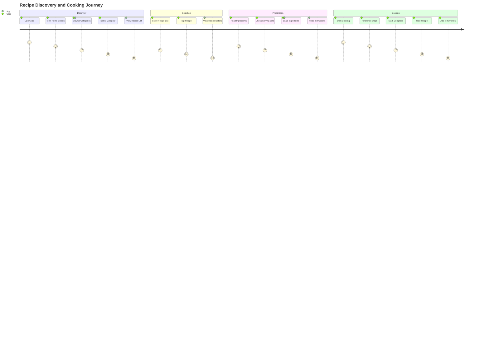
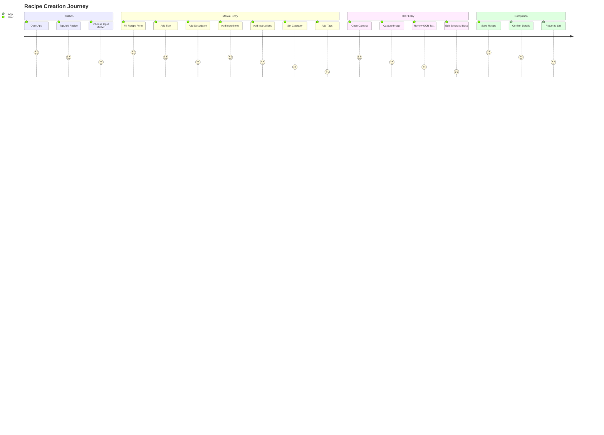
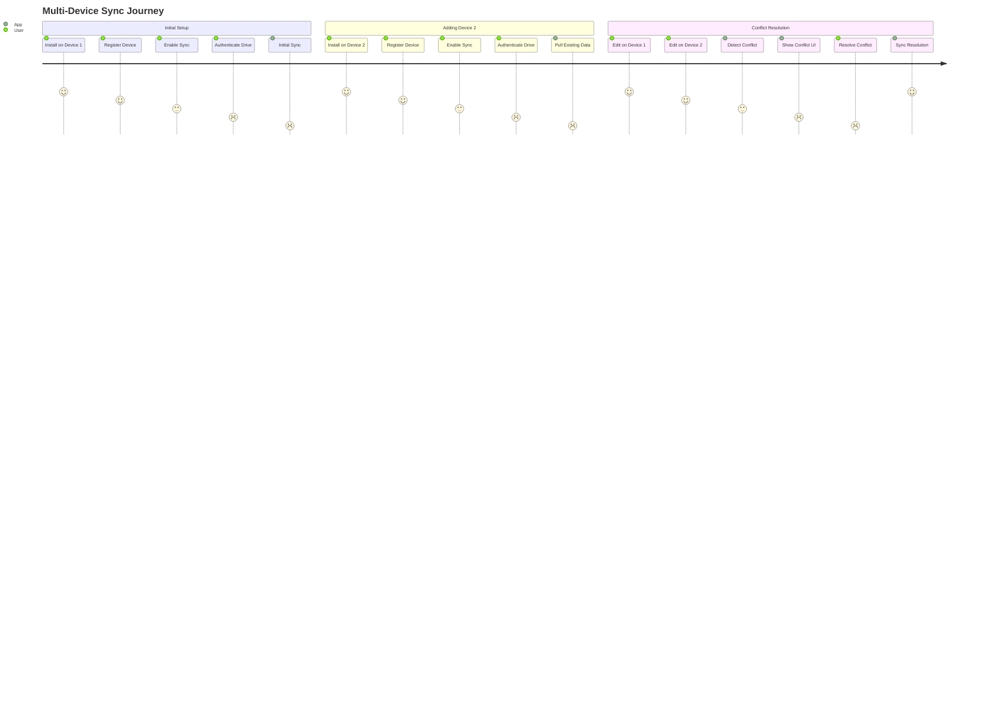

# Cookbook Android - UX Foundation

## 🎨 Design System Overview

**Project**: Our Cookbook Android App  
**Platform**: Android 8.0+ (API 26+), Chromebooks  
**UI Framework**: Jetpack Compose  
**Design Philosophy**: Clean, intuitive, and accessible recipe management

## 🎯 User Personas

### Primary Persona: Home Chef Sarah
- **Age**: 35-45
- **Background**: Works full-time, cooks for family of 4
- **Goals**: Quickly find recipes, manage grocery lists, share with family
- **Pain Points**: Multiple devices, offline access, easy organization
- **Tech Savvy**: Moderate - comfortable with smartphones but not power user

### Secondary Persona: Professional Chef Mike
- **Age**: 25-35
- **Background**: Professional chef, recipe collector
- **Goals**: Organize extensive recipe collection, detailed ingredient tracking
- **Pain Points**: Complex recipes, precise measurements, bulk operations
- **Tech Savvy**: High - expects advanced features and customization

### Tertiary Persona: Retired Grandma Linda
- **Age**: 65+
- **Background**: Retired, cooks traditional family recipes
- **Goals**: Preserve family recipes, simple interface, large text
- **Pain Points**: Small screens, complex navigation, accessibility
- **Tech Savvy**: Low - needs simple, forgiving interface

## 🗺️ User Journey Maps

### Primary Journey: Finding and Cooking a Recipe



### Secondary Journey: Adding a New Recipe



### Sync Journey: Multi-Device Management



## 🎨 Design Tokens

### Color Palette

```kotlin
// Theme.kt
val CookbookColors = CookbookColors(
    // Primary colors - Food inspired
    primary = Color(0xFFE57373),      // Soft red (tomatoes, peppers)
    primaryVariant = Color(0xFFC62828), // Deep red
    primaryLight = Color(0xFFFFCDD2), // Light red
    
    // Secondary colors - Earth tones
    secondary = Color(0xFF81C784),    // Soft green (herbs)
    secondaryVariant = Color(0xFF388E3C), // Deep green
    secondaryLight = Color(0xFFC8E6C9), // Light green
    
    // Surface colors
    surface = Color(0xFFFFFFFF),     // White
    surfaceVariant = Color(0xFFF5F5F5), // Light gray
    background = Color(0xFFF5F5F5),   // Light background
    
    // Text colors
    onPrimary = Color(0xFFFFFFFF),   // White text on primary
    onSecondary = Color(0xFFFFFFFF), // White text on secondary
    onSurface = Color(0xFF212121),   // Dark text on surface
    onBackground = Color(0xFF212121), // Dark text on background
    
    // Status colors
    success = Color(0xFF4CAF50),     // Success green
    warning = Color(0xFFFFC107),     // Warning amber
    error = Color(0xFFF44336),       // Error red
    info = Color(0xFF2196F3),        // Info blue
    
    // Category colors
    breakfast = Color(0xFFFFC107),   // Amber (morning)
    mains = Color(0xFFE57373),       // Red (main dishes)
    desserts = Color(0xFFE91E63),    // Pink (sweet)
    sides = Color(0xFF81C784),       // Green (fresh)
    sauces = Color(0xFFFF9800)      // Orange (spicy)
)
```

### Typography System

```kotlin
// Typography.kt
val CookbookTypography = Typography(
    defaultFontFamily = FontFamily(
        Font(R.font.roboto_regular),
        Font(R.font.roboto_medium, FontWeight.Medium),
        Font(R.font.roboto_bold, FontWeight.Bold)
    ),
    
    // Headings
    h1 = TextStyle(
        fontSize = 28.sp,
        fontWeight = FontWeight.Bold,
        lineHeight = 32.sp,
        letterSpacing = (-0.5).sp
    ),
    h2 = TextStyle(
        fontSize = 24.sp,
        fontWeight = FontWeight.Bold,
        lineHeight = 28.sp,
        letterSpacing = (-0.5).sp
    ),
    h3 = TextStyle(
        fontSize = 20.sp,
        fontWeight = FontWeight.Bold,
        lineHeight = 24.sp
    ),
    h4 = TextStyle(
        fontSize = 18.sp,
        fontWeight = FontWeight.Bold,
        lineHeight = 22.sp
    ),
    h5 = TextStyle(
        fontSize = 16.sp,
        fontWeight = FontWeight.Bold,
        lineHeight = 20.sp
    ),
    h6 = TextStyle(
        fontSize = 14.sp,
        fontWeight = FontWeight.Bold,
        lineHeight = 18.sp
    ),
    
    // Body text
    body1 = TextStyle(
        fontSize = 16.sp,
        fontWeight = FontWeight.Normal,
        lineHeight = 24.sp,
        letterSpacing = 0.5.sp
    ),
    body2 = TextStyle(
        fontSize = 14.sp,
        fontWeight = FontWeight.Normal,
        lineHeight = 20.sp,
        letterSpacing = 0.25.sp
    ),
    
    // Special text
    subtitle1 = TextStyle(
        fontSize = 16.sp,
        fontWeight = FontWeight.Medium,
        lineHeight = 24.sp,
        letterSpacing = 0.15.sp
    ),
    subtitle2 = TextStyle(
        fontSize = 14.sp,
        fontWeight = FontWeight.Medium,
        lineHeight = 20.sp,
        letterSpacing = 0.1.sp
    ),
    
    // Interactive text
    button = TextStyle(
        fontSize = 14.sp,
        fontWeight = FontWeight.Bold,
        lineHeight = 16.sp,
        letterSpacing = 1.25.sp
    ),
    caption = TextStyle(
        fontSize = 12.sp,
        fontWeight = FontWeight.Normal,
        lineHeight = 16.sp,
        letterSpacing = 0.4.sp
    ),
    overline = TextStyle(
        fontSize = 12.sp,
        fontWeight = FontWeight.Bold,
        lineHeight = 16.sp,
        letterSpacing = 1.5.sp
    )
)
```

### Spacing System

```kotlin
// Spacing.kt
object CookbookSpacing {
    // Base unit: 4dp
    val xxSmall = 4.dp
    val xSmall = 8.dp
    val small = 12.dp
    val medium = 16.dp
    val large = 24.dp
    val xLarge = 32.dp
    val xxLarge = 48.dp
    val xxxLarge = 64.dp
    
    // Special spacing
    val touchTarget = 48.dp  // Minimum touch target size
    val cardElevation = 4.dp
    val dividerHeight = 1.dp
    val borderWidth = 1.dp
    
    // Screen margins
    val screenMargin = 16.dp
    val screenMarginLarge = 24.dp
    
    // Component spacing
    val buttonPadding = PaddingValues(
        horizontal = large,
        vertical = medium
    )
    val cardPadding = PaddingValues(all = medium)
    val listItemPadding = PaddingValues(
        horizontal = medium,
        vertical = small
    )
}
```

### Elevation System

```kotlin
// Elevation.kt
object CookbookElevation {
    val none = 0.dp
    val small = 2.dp
    val medium = 4.dp
    val large = 8.dp
    val xLarge = 12.dp
    
    // Component elevations
    val card = medium
    val dialog = large
    val bottomBar = large
    val fab = large
    val button = small
    val snackbar = large
}
```

## 🎭 Theme System

### Light and Dark Themes

```kotlin
// Theme.kt
val LightColorScheme = lightColorScheme(
    primary = CookbookColors.primary,
    primaryContainer = CookbookColors.primaryLight,
    onPrimary = CookbookColors.onPrimary,
    secondary = CookbookColors.secondary,
    secondaryContainer = CookbookColors.secondaryLight,
    onSecondary = CookbookColors.onSecondary,
    surface = CookbookColors.surface,
    surfaceVariant = CookbookColors.surfaceVariant,
    onSurface = CookbookColors.onSurface,
    background = CookbookColors.background,
    onBackground = CookbookColors.onBackground,
    error = CookbookColors.error,
    onError = Color.White,
    outline = Color(0xFF757575),
    outlineVariant = Color(0xFFC2C2C2)
)

val DarkColorScheme = darkColorScheme(
    primary = CookbookColors.primary,
    primaryContainer = CookbookColors.primaryLight,
    onPrimary = CookbookColors.onPrimary,
    secondary = CookbookColors.secondary,
    secondaryContainer = CookbookColors.secondaryLight,
    onSecondary = CookbookColors.onSecondary,
    surface = Color(0xFF121212),
    surfaceVariant = Color(0xFF1E1E1E),
    onSurface = Color(0xFFFFFFFF),
    background = Color(0xFF121212),
    onBackground = Color(0xFFFFFFFF),
    error = CookbookColors.error,
    onError = Color.White,
    outline = Color(0xFF9E9E9E),
    outlineVariant = Color(0xFF424242)
)

@Composable
fun CookbookTheme(
    darkTheme: Boolean = isSystemInDarkTheme(),
    content: @Composable () -> Unit
) {
    val colorScheme = if (darkTheme) DarkColorScheme else LightColorScheme
    
    MaterialTheme(
        colorScheme = colorScheme,
        typography = CookbookTypography,
        content = content
    )
}
```

## 🧩 Component Library

### Buttons

```kotlin
// Buttons.kt
@Composable
fun CookbookPrimaryButton(
    text: String,
    onClick: () -> Unit,
    modifier: Modifier = Modifier,
    enabled: Boolean = true,
    loading: Boolean = false
) {
    Button(
        onClick = onClick,
        modifier = modifier
            .height(48.dp)
            .fillMaxWidth(),
        enabled = enabled && !loading,
        colors = ButtonDefaults.buttonColors(
            containerColor = MaterialTheme.colorScheme.primary,
            contentColor = MaterialTheme.colorScheme.onPrimary,
            disabledContainerColor = MaterialTheme.colorScheme.primary.copy(alpha = 0.5f),
            disabledContentColor = MaterialTheme.colorScheme.onPrimary.copy(alpha = 0.5f)
        ),
        shape = RoundedCornerShape(8.dp),
        elevation = ButtonDefaults.buttonElevation(
            defaultElevation = CookbookElevation.small,
            pressedElevation = CookbookElevation.medium
        )
    ) {
        if (loading) {
            CircularProgressIndicator(
                color = MaterialTheme.colorScheme.onPrimary,
                strokeWidth = 2.dp,
                modifier = Modifier.size(20.dp)
            )
        } else {
            Text(
                text = text.uppercase(),
                style = CookbookTypography.button
            )
        }
    }
}

@Composable
fun CookbookSecondaryButton(
    text: String,
    onClick: () -> Unit,
    modifier: Modifier = Modifier,
    enabled: Boolean = true
) {
    OutlinedButton(
        onClick = onClick,
        modifier = modifier
            .height(48.dp)
            .fillMaxWidth(),
        enabled = enabled,
        colors = ButtonDefaults.outlinedButtonColors(
            contentColor = MaterialTheme.colorScheme.primary,
            disabledContentColor = MaterialTheme.colorScheme.primary.copy(alpha = 0.5f)
        ),
        shape = RoundedCornerShape(8.dp),
        border = BorderStroke(1.dp, MaterialTheme.colorScheme.outline)
    ) {
        Text(
            text = text.uppercase(),
            style = CookbookTypography.button
        )
    }
}

@Composable
fun CookbookIconButton(
    icon: ImageVector,
    onClick: () -> Unit,
    modifier: Modifier = Modifier,
    contentDescription: String? = null
) {
    IconButton(
        onClick = onClick,
        modifier = modifier.size(48.dp),
        colors = IconButtonDefaults.iconButtonColors(
            containerColor = MaterialTheme.colorScheme.surfaceVariant,
            contentColor = MaterialTheme.colorScheme.onSurface
        )
    ) {
        Icon(
            imageVector = icon,
            contentDescription = contentDescription,
            modifier = Modifier.size(24.dp)
        )
    }
}
```

### Cards

```kotlin
// Cards.kt
@Composable
fun CookbookCard(
    modifier: Modifier = Modifier,
    elevation: Dp = CookbookElevation.medium,
    onClick: (() -> Unit)? = null,
    content: @Composable () -> Unit
) {
    val cardModifier = modifier
        .then(if (onClick != null) Modifier.clickable(onClick = onClick) else Modifier)
    
    Card(
        modifier = cardModifier,
        elevation = CardDefaults.cardElevation(defaultElevation = elevation),
        shape = RoundedCornerShape(12.dp),
        colors = CardDefaults.cardColors(
            containerColor = MaterialTheme.colorScheme.surface,
            contentColor = MaterialTheme.colorScheme.onSurface
        ),
        border = if (onClick != null) 
            BorderStroke(1.dp, MaterialTheme.colorScheme.outlineVariant) 
            else null
    ) {
        content()
    }
}

@Composable
fun RecipeCard(
    recipe: Recipe,
    onClick: () -> Unit,
    modifier: Modifier = Modifier
) {
    CookbookCard(
        modifier = modifier.fillMaxWidth(),
        elevation = CookbookElevation.medium,
        onClick = onClick
    ) {
        Column(modifier = Modifier.padding(CookbookSpacing.medium)) {
            // Recipe image
            RecipeImage(
                imageUrl = recipe.imageUrl,
                contentDescription = recipe.title,
                modifier = Modifier
                    .fillMaxWidth()
                    .aspectRatio(16f / 9f)
                    .clip(RoundedCornerShape(8.dp))
            )
            
            Spacer(modifier = Modifier.height(CookbookSpacing.small))
            
            // Recipe title
            Text(
                text = recipe.title,
                style = CookbookTypography.h6,
                maxLines = 1,
                overflow = TextOverflow.Ellipsis
            )
            
            Spacer(modifier = Modifier.height(CookbookSpacing.xSmall))
            
            // Recipe metadata
            Row(
                verticalAlignment = Alignment.CenterVertically,
                horizontalArrangement = Arrangement.Start
            ) {
                // Category badge
                CategoryBadge(category = recipe.category)
                
                Spacer(modifier = Modifier.width(CookbookSpacing.small))
                
                // Rating
                RatingDisplay(rating = recipe.rating)
                
                Spacer(modifier = Modifier.width(CookbookSpacing.small))
                
                // Cook time
                if (recipe.cookTime != null) {
                    CookTimeDisplay(minutes = recipe.cookTime)
                }
            }
            
            Spacer(modifier = Modifier.height(CookbookSpacing.xSmall))
            
            // Description preview
            Text(
                text = recipe.description ?: "",
                style = CookbookTypography.body2,
                maxLines = 2,
                overflow = TextOverflow.Ellipsis,
                color = MaterialTheme.colorScheme.onSurface.copy(alpha = 0.7f)
            )
        }
    }
}
```

### Input Fields

```kotlin
// InputFields.kt
@Composable
fun CookbookTextField(
    value: String,
    onValueChange: (String) -> Unit,
    label: String,
    modifier: Modifier = Modifier,
    placeholder: String? = null,
    leadingIcon: ImageVector? = null,
    trailingIcon: ImageVector? = null,
    isError: Boolean = false,
    errorMessage: String? = null,
    keyboardType: KeyboardType = KeyboardType.Text,
    maxLines: Int = 1,
    readOnly: Boolean = false
) {
    Column(modifier = modifier) {
        OutlinedTextField(
            value = value,
            onValueChange = onValueChange,
            label = { Text(label) },
            placeholder = placeholder?.let { { Text(it) } },
            leadingIcon = leadingIcon?.let { 
                { Icon(imageVector = it, contentDescription = null) }
            },
            trailingIcon = trailingIcon?.let { 
                { Icon(imageVector = it, contentDescription = null) }
            },
            isError = isError,
            keyboardOptions = KeyboardOptions(
                keyboardType = keyboardType,
                imeAction = ImeAction.Next
            ),
            keyboardActions = KeyboardActions(
                onNext = { /* Handle next action */ }
            ),
            maxLines = maxLines,
            readOnly = readOnly,
            modifier = Modifier.fillMaxWidth(),
            colors = OutlinedTextFieldDefaults.colors(
                focusedBorderColor = MaterialTheme.colorScheme.primary,
                unfocusedBorderColor = MaterialTheme.colorScheme.outline,
                errorBorderColor = MaterialTheme.colorScheme.error,
                focusedLabelColor = MaterialTheme.colorScheme.primary,
                unfocusedLabelColor = MaterialTheme.colorScheme.onSurface.copy(alpha = 0.6f)
            ),
            shape = RoundedCornerShape(8.dp)
        )
        
        if (isError && errorMessage != null) {
            Text(
                text = errorMessage,
                color = MaterialTheme.colorScheme.error,
                style = CookbookTypography.caption,
                modifier = Modifier.padding(start = CookbookSpacing.small, top = CookbookSpacing.xSmall)
            )
        }
    }
}

@Composable
fun CookbookMultilineTextField(
    value: String,
    onValueChange: (String) -> Unit,
    label: String,
    modifier: Modifier = Modifier,
    placeholder: String? = null,
    isError: Boolean = false,
    errorMessage: String? = null,
    minLines: Int = 3,
    maxLines: Int = Int.MAX_VALUE
) {
    CookbookTextField(
        value = value,
        onValueChange = onValueChange,
        label = label,
        modifier = modifier,
        placeholder = placeholder,
        isError = isError,
        errorMessage = errorMessage,
        maxLines = maxLines,
        keyboardType = KeyboardType.Text,
        readOnly = false
    )
}

@Composable
fun CookbookNumberField(
    value: String,
    onValueChange: (String) -> Unit,
    label: String,
    modifier: Modifier = Modifier,
    placeholder: String? = null,
    isError: Boolean = false,
    errorMessage: String? = null,
    suffix: String? = null
) {
    CookbookTextField(
        value = value,
        onValueChange = { newValue ->
            if (newValue.all { it.isDigit() }) {
                onValueChange(newValue)
            }
        },
        label = label,
        modifier = modifier,
        placeholder = placeholder,
        isError = isError,
        errorMessage = errorMessage,
        keyboardType = KeyboardType.Number,
        trailingIcon = if (suffix != null) {
            Icon(
                imageVector = Icons.Default.Info,
                contentDescription = suffix
            )
        } else null
    )
}
```

### Lists and Collections

```kotlin
// Lists.kt
@Composable
fun CookbookLazyColumn(
    modifier: Modifier = Modifier,
    contentPadding: PaddingValues = PaddingValues(CookbookSpacing.medium),
    verticalArrangement: Arrangement.Vertical = Arrangement.spacedBy(CookbookSpacing.small),
    content: LazyListScope.() -> Unit
) {
    LazyColumn(
        modifier = modifier,
        contentPadding = contentPadding,
        verticalArrangement = verticalArrangement
    ) {
        content()
    }
}

@Composable
fun RecipeList(
    recipes: List<Recipe>,
    onRecipeClick: (Recipe) -> Unit,
    modifier: Modifier = Modifier,
    emptyContent: @Composable () -> Unit = {
        EmptyState(
            icon = Icons.Default.Search,
            title = "No recipes found",
            description = "Try adding a new recipe or adjusting your search"
        )
    }
) {
    if (recipes.isEmpty()) {
        emptyContent()
    } else {
        CookbookLazyColumn(modifier = modifier) {
            items(recipes, key = { it.id }) { recipe ->
                RecipeCard(
                    recipe = recipe,
                    onClick = { onRecipeClick(recipe) },
                    modifier = Modifier
                        .fillMaxWidth()
                        .padding(vertical = CookbookSpacing.xSmall)
                )
            }
        }
    }
}

@Composable
fun CategoryChip(
    category: String,
    isSelected: Boolean = false,
    onClick: () -> Unit,
    modifier: Modifier = Modifier
) {
    val categoryColor = when (category.lowercase()) {
        "breakfasts" -> CookbookColors.breakfast
        "mains" -> CookbookColors.mains
        "desserts & snacks" -> CookbookColors.desserts
        "sides" -> CookbookColors.sides
        "sauces and spices" -> CookbookColors.sauces
        else -> MaterialTheme.colorScheme.primary
    }
    
    FilterChip(
        selected = isSelected,
        onClick = onClick,
        modifier = modifier,
        colors = FilterChipDefaults.filterChipColors(
            selectedContainerColor = categoryColor,
            selectedLabelColor = Color.White,
            containerColor = categoryColor.copy(alpha = 0.2f),
            labelColor = categoryColor
        ),
        border = FilterChipDefaults.filterChipBorder(
            borderColor = categoryColor,
            selectedBorderColor = categoryColor
        )
    ) {
        Text(
            text = category,
            style = CookbookTypography.body2
        )
    }
}
```

### Navigation Components

```kotlin
// Navigation.kt
@Composable
fun CookbookBottomNavigation(
    currentRoute: String,
    onNavigate: (String) -> Unit,
    modifier: Modifier = Modifier
) {
    val items = listOf(
        BottomNavItem(
            route = Route.HOME,
            icon = Icons.Default.Home,
            label = "Home",
            contentDescription = "Home"
        ),
        BottomNavItem(
            route = Route.RECIPE_LIST,
            icon = Icons.Default.List,
            label = "Recipes",
            contentDescription = "Recipes"
        ),
        BottomNavItem(
            route = Route.SEARCH,
            icon = Icons.Default.Search,
            label = "Search",
            contentDescription = "Search"
        ),
        BottomNavItem(
            route = Route.COOKBOOK_MANAGEMENT,
            icon = Icons.Default.Folder,
            label = "Cookbooks",
            contentDescription = "Cookbooks"
        ),
        BottomNavItem(
            route = Route.SETTINGS,
            icon = Icons.Default.Settings,
            label = "Settings",
            contentDescription = "Settings"
        )
    )
    
    BottomAppBar(
        modifier = modifier,
        containerColor = MaterialTheme.colorScheme.surface,
        contentColor = MaterialTheme.colorScheme.onSurface
    ) {
        items.forEach { item ->
            NavigationBarItem(
                selected = currentRoute == item.route,
                onClick = { onNavigate(item.route) },
                icon = {
                    Icon(
                        imageVector = item.icon,
                        contentDescription = item.contentDescription
                    )
                },
                label = { Text(item.label) },
                colors = NavigationBarItemDefaults.colors(
                    selectedIconColor = MaterialTheme.colorScheme.primary,
                    unselectedIconColor = MaterialTheme.colorScheme.onSurface.copy(alpha = 0.6f),
                    selectedTextColor = MaterialTheme.colorScheme.primary,
                    unselectedTextColor = MaterialTheme.colorScheme.onSurface.copy(alpha = 0.6f),
                    indicatorColor = MaterialTheme.colorScheme.primary.copy(alpha = 0.1f)
                )
            )
        }
    }
}

@Composable
fun CookbookTopAppBar(
    title: String,
    navigationIcon: ImageVector? = null,
    onNavigationClick: () -> Unit = {},
    actions: @Composable RowScope.() -> Unit = {},
    modifier: Modifier = Modifier
) {
    TopAppBar(
        title = { Text(title, style = CookbookTypography.h6) },
        navigationIcon = navigationIcon?.let {
            {
                IconButton(onClick = onNavigationClick) {
                    Icon(
                        imageVector = it,
                        contentDescription = "Navigate back"
                    )
                }
            }
        },
        actions = actions,
        modifier = modifier,
        colors = TopAppBarDefaults.topAppBarColors(
            containerColor = MaterialTheme.colorScheme.surface,
            titleContentColor = MaterialTheme.colorScheme.onSurface,
            navigationIconContentColor = MaterialTheme.colorScheme.onSurface,
            actionIconContentColor = MaterialTheme.colorScheme.onSurface
        )
    )
}
```

## 📱 Screen Designs

### Home Screen

```kotlin
// HomeScreen.kt
@Composable
fun HomeScreen(
    viewModel: HomeViewModel = hiltViewModel(),
    onNavigate: (String) -> Unit
) {
    val state by viewModel.state.collectAsState()
    
    Scaffold(
        topBar = {
            CookbookTopAppBar(
                title = "Our Cookbook",
                actions = {
                    IconButton(onClick = { onNavigate(Route.SEARCH) }) {
                        Icon(
                            imageVector = Icons.Default.Search,
                            contentDescription = "Search"
                        )
                    }
                    IconButton(onClick = { onNavigate(Route.SYNC_STATUS) }) {
                        SyncStatusIcon(status = state.syncStatus)
                    }
                }
            )
        },
        bottomBar = {
            CookbookBottomNavigation(
                currentRoute = Route.HOME,
                onNavigate = onNavigate
            )
        },
        floatingActionButton = {
            FloatingActionButton(
                onClick = { onNavigate(Route.RECIPE_CREATE) },
                containerColor = MaterialTheme.colorScheme.primary,
                contentColor = MaterialTheme.colorScheme.onPrimary,
                elevation = FloatingActionButtonDefaults.elevation(
                    defaultElevation = CookbookElevation.large,
                    pressedElevation = CookbookElevation.xLarge
                )
            ) {
                Icon(
                    imageVector = Icons.Default.Add,
                    contentDescription = "Add Recipe"
                )
            }
        }
    ) { paddingValues ->
        CookbookLazyColumn(
            modifier = Modifier.padding(paddingValues),
            contentPadding = PaddingValues(CookbookSpacing.medium)
        ) {
            // Quick actions
            item {
                QuickActionsSection(onNavigate = onNavigate)
                Spacer(modifier = Modifier.height(CookbookSpacing.large))
            }
            
            // Recent recipes
            item {
                SectionHeader(
                    title = "Recent Recipes",
                    actionText = "View All",
                    onActionClick = { onNavigate(Route.RECIPE_LIST) }
                )
                Spacer(modifier = Modifier.height(CookbookSpacing.small))
            }
            
            items(state.recentRecipes, key = { it.id }) { recipe ->
                RecipeCard(
                    recipe = recipe,
                    onClick = { onNavigate("${Route.RECIPE_DETAIL}/${recipe.id}") },
                    modifier = Modifier
                        .fillMaxWidth()
                        .padding(vertical = CookbookSpacing.xSmall)
                )
            }
            
            // Categories
            item {
                Spacer(modifier = Modifier.height(CookbookSpacing.large))
                SectionHeader(title = "Categories")
                Spacer(modifier = Modifier.height(CookbookSpacing.small))
            }
            
            item {
                CategoryGrid(
                    categories = state.categories,
                    onCategoryClick = { category ->
                        onNavigate("${Route.RECIPE_LIST}?category=$category")
                    }
                )
            }
            
            // Favorites
            item {
                if (state.favorites.isNotEmpty()) {
                    Spacer(modifier = Modifier.height(CookbookSpacing.large))
                    SectionHeader(
                        title = "Favorites",
                        actionText = "View All",
                        onActionClick = { onNavigate("${Route.RECIPE_LIST}?favorites=true") }
                    )
                    Spacer(modifier = Modifier.height(CookbookSpacing.small))
                }
            }
            
            items(state.favorites, key = { it.id }) { recipe ->
                RecipeCard(
                    recipe = recipe,
                    onClick = { onNavigate("${Route.RECIPE_DETAIL}/${recipe.id}") },
                    modifier = Modifier
                        .fillMaxWidth()
                        .padding(vertical = CookbookSpacing.xSmall)
                )
            }
        }
    }
}

@Composable
fun QuickActionsSection(onNavigate: (String) -> Unit) {
    Row(
        horizontalArrangement = Arrangement.spacedBy(CookbookSpacing.medium),
        modifier = Modifier.fillMaxWidth()
    ) {
        QuickActionButton(
            icon = Icons.Default.Add,
            label = "New Recipe",
            onClick = { onNavigate(Route.RECIPE_CREATE) }
        )
        QuickActionButton(
            icon = Icons.Default.Camera,
            label = "Scan Recipe",
            onClick = { onNavigate(Route.OCR_SCANNER) }
        )
        QuickActionButton(
            icon = Icons.Default.Import,
            label = "Import",
            onClick = { onNavigate("${Route.RECIPE_LIST}?import=true") }
        )
        QuickActionButton(
            icon = Icons.Default.Sync,
            label = "Sync",
            onClick = { onNavigate(Route.SYNC_STATUS) }
        )
    }
}

@Composable
fun QuickActionButton(
    icon: ImageVector,
    label: String,
    onClick: () -> Unit
) {
    Column(
        horizontalAlignment = Alignment.CenterHorizontally,
        modifier = Modifier
            .clickable(onClick = onClick)
            .padding(CookbookSpacing.small)
    ) {
        Box(
            contentAlignment = Alignment.Center,
            modifier = Modifier
                .size(64.dp)
                .background(
                    color = MaterialTheme.colorScheme.primary.copy(alpha = 0.1f),
                    shape = RoundedCornerShape(12.dp)
                )
        ) {
            Icon(
                imageVector = icon,
                contentDescription = label,
                tint = MaterialTheme.colorScheme.primary,
                modifier = Modifier.size(32.dp)
            )
        }
        Spacer(modifier = Modifier.height(CookbookSpacing.xSmall))
        Text(
            text = label,
            style = CookbookTypography.caption,
            color = MaterialTheme.colorScheme.onSurface
        )
    }
}
```

### Recipe Detail Screen

```kotlin
// RecipeDetailScreen.kt
@Composable
fun RecipeDetailScreen(
    recipeId: String,
    viewModel: RecipeDetailViewModel = hiltViewModel(),
    onNavigate: (String) -> Unit
) {
    val state by viewModel.state.collectAsState()
    
    LaunchedEffect(recipeId) {
        viewModel.loadRecipe(recipeId)
    }
    
    Scaffold(
        topBar = {
            CookbookTopAppBar(
                title = state.recipe?.title ?: "Recipe",
                navigationIcon = Icons.Default.ArrowBack,
                onNavigationClick = { onNavigate(Route.RECIPE_LIST) },
                actions = {
                    IconButton(onClick = { /* Share recipe */ }) {
                        Icon(
                            imageVector = Icons.Default.Share,
                            contentDescription = "Share"
                        )
                    }
                    IconButton(onClick = { viewModel.toggleFavorite() }) {
                        Icon(
                            imageVector = if (state.isFavorite) 
                                Icons.Default.Favorite else Icons.Default.FavoriteBorder,
                            contentDescription = "Favorite",
                            tint = if (state.isFavorite) 
                                MaterialTheme.colorScheme.error else MaterialTheme.colorScheme.onSurface
                        )
                    }
                }
            )
        },
        bottomBar = {
            BottomAppBar(
                modifier = Modifier.padding(CookbookSpacing.medium),
                containerColor = MaterialTheme.colorScheme.surface
            ) {
                CookbookPrimaryButton(
                    text = "Start Cooking",
                    onClick = { /* Start cooking mode */ },
                    modifier = Modifier.weight(1f)
                )
            }
        }
    ) { paddingValues ->
        state.recipe?.let { recipe ->
            CookbookLazyColumn(
                modifier = Modifier.padding(paddingValues),
                contentPadding = PaddingValues(CookbookSpacing.medium)
            ) {
                // Recipe image
                item {
                    RecipeImage(
                        imageUrl = recipe.imageUrl,
                        contentDescription = recipe.title,
                        modifier = Modifier
                            .fillMaxWidth()
                            .aspectRatio(16f / 9f)
                            .clip(RoundedCornerShape(12.dp))
                    )
                    Spacer(modifier = Modifier.height(CookbookSpacing.large))
                }
                
                // Recipe header
                item {
                    Column {
                        Text(
                            text = recipe.title,
                            style = CookbookTypography.h3
                        )
                        
                        Spacer(modifier = Modifier.height(CookbookSpacing.small))
                        
                        Row(
                            verticalAlignment = Alignment.CenterVertically,
                            horizontalArrangement = Arrangement.Start
                        ) {
                            CategoryBadge(category = recipe.category)
                            Spacer(modifier = Modifier.width(CookbookSpacing.small))
                            RatingDisplay(rating = recipe.rating)
                            Spacer(modifier = Modifier.width(CookbookSpacing.small))
                            CookTimeDisplay(minutes = recipe.cookTime)
                            Spacer(modifier = Modifier.width(CookbookSpacing.small))
                            ServingSizeDisplay(servings = recipe.servingSize)
                        }
                        
                        Spacer(modifier = Modifier.height(CookbookSpacing.medium))
                        
                        // Description
                        if (!recipe.description.isNullOrEmpty()) {
                            Text(
                                text = recipe.description,
                                style = CookbookTypography.body1
                            )
                            Spacer(modifier = Modifier.height(CookbookSpacing.large))
                        }
                    }
                }
                
                // Ingredients section
                item {
                    SectionHeader(title = "Ingredients")
                    Spacer(modifier = Modifier.height(CookbookSpacing.small))
                }
                
                items(recipe.ingredients) { ingredient ->
                    IngredientItem(
                        ingredient = ingredient,
                        showCheckbox = true,
                        checked = state.checkedIngredients.contains(ingredient.id),
                        onCheckedChange = { checked ->
                            viewModel.toggleIngredientChecked(ingredient.id, checked)
                        }
                    )
                    if (ingredient != recipe.ingredients.last()) {
                        Divider(
                            color = MaterialTheme.colorScheme.outlineVariant,
                            modifier = Modifier.padding(start = CookbookSpacing.medium)
                        )
                    }
                }
                
                // Instructions section
                item {
                    Spacer(modifier = Modifier.height(CookbookSpacing.large))
                    SectionHeader(title = "Instructions")
                    Spacer(modifier = Modifier.height(CookbookSpacing.small))
                }
                
                itemsIndexed(recipe.instructions) { index, instruction ->
                    InstructionStep(
                        stepNumber = index + 1,
                        instruction = instruction,
                        checked = state.checkedSteps.contains(index),
                        onCheckedChange = { checked ->
                            viewModel.toggleStepChecked(index, checked)
                        }
                    )
                    if (index != recipe.instructions.lastIndex) {
                        Spacer(modifier = Modifier.height(CookbookSpacing.small))
                    }
                }
                
                // Notes section
                item {
                    if (!recipe.notes.isNullOrEmpty()) {
                        Spacer(modifier = Modifier.height(CookbookSpacing.large))
                        SectionHeader(title = "Notes")
                        Spacer(modifier = Modifier.height(CookbookSpacing.small))
                        Text(
                            text = recipe.notes,
                            style = CookbookTypography.body1,
                            modifier = Modifier
                                .fillMaxWidth()
                                .background(
                                    color = MaterialTheme.colorScheme.surfaceVariant,
                                    shape = RoundedCornerShape(8.dp)
                                )
                                .padding(CookbookSpacing.medium)
                        )
                    }
                }
                
                // Metadata section
                item {
                    Spacer(modifier = Modifier.height(CookbookSpacing.large))
                    SectionHeader(title = "Recipe Information")
                    Spacer(modifier = Modifier.height(CookbookSpacing.small))
                    
                    RecipeMetadata(
                        createdAt = recipe.createdAt,
                        updatedAt = recipe.updatedAt,
                        source = recipe.source,
                        tags = recipe.tags
                    )
                }
                
                // Action buttons
                item {
                    Spacer(modifier = Modifier.height(CookbookSpacing.large))
                    Row(
                        horizontalArrangement = Arrangement.spacedBy(CookbookSpacing.medium),
                        modifier = Modifier.fillMaxWidth()
                    ) {
                        CookbookSecondaryButton(
                            text = "Edit",
                            onClick = { onNavigate("${Route.RECIPE_EDIT}/${recipe.id}") },
                            modifier = Modifier.weight(1f)
                        )
                        CookbookSecondaryButton(
                            text = "Delete",
                            onClick = { viewModel.showDeleteDialog() },
                            modifier = Modifier.weight(1f),
                            enabled = true
                        )
                    }
                }
            }
        } ?: run {
            LoadingState()
        }
    }
    
    // Delete confirmation dialog
    if (state.showDeleteDialog) {
        AlertDialog(
            onDismissRequest = { viewModel.hideDeleteDialog() },
            title = { Text("Delete Recipe") },
            text = { Text("Are you sure you want to delete this recipe? This action cannot be undone.") },
            confirmButton = {
                TextButton(onClick = { viewModel.deleteRecipe() }) {
                    Text("Delete", color = MaterialTheme.colorScheme.error)
                }
            },
            dismissButton = {
                TextButton(onClick = { viewModel.hideDeleteDialog() }) {
                    Text("Cancel")
                }
            }
        )
    }
}

@Composable
fun IngredientItem(
    ingredient: Ingredient,
    showCheckbox: Boolean = false,
    checked: Boolean = false,
    onCheckedChange: (Boolean) -> Unit = {}
) {
    Row(
        verticalAlignment = Alignment.CenterVertically,
        modifier = Modifier
            .fillMaxWidth()
            .padding(vertical = CookbookSpacing.small)
    ) {
        if (showCheckbox) {
            Checkbox(
                checked = checked,
                onCheckedChange = onCheckedChange,
                colors = CheckboxDefaults.colors(
                    checkedColor = MaterialTheme.colorScheme.primary,
                    uncheckedColor = MaterialTheme.colorScheme.outline
                )
            )
            Spacer(modifier = Modifier.width(CookbookSpacing.small))
        }
        
        Column {
            // Ingredient name and amount
            Row(
                verticalAlignment = Alignment.Baseline
            ) {
                Text(
                    text = ingredient.amount?.let { "$it " } ?: "",
                    style = CookbookTypography.body1,
                    fontWeight = FontWeight.Bold
                )
                Text(
                    text = ingredient.name,
                    style = CookbookTypography.body1
                )
            }
            
            // Ingredient notes
            if (!ingredient.notes.isNullOrEmpty()) {
                Text(
                    text = ingredient.notes,
                    style = CookbookTypography.caption,
                    color = MaterialTheme.colorScheme.onSurface.copy(alpha = 0.6f),
                    modifier = Modifier.padding(start = CookbookSpacing.xSmall)
                )
            }
        }
    }
}

@Composable
fun InstructionStep(
    stepNumber: Int,
    instruction: String,
    checked: Boolean = false,
    onCheckedChange: (Boolean) -> Unit = {}
) {
    Row(
        verticalAlignment = Alignment.Top,
        modifier = Modifier
            .fillMaxWidth()
            .padding(vertical = CookbookSpacing.xSmall)
    ) {
        if (onCheckedChange != {}) {
            Checkbox(
                checked = checked,
                onCheckedChange = onCheckedChange,
                colors = CheckboxDefaults.colors(
                    checkedColor = MaterialTheme.colorScheme.primary,
                    uncheckedColor = MaterialTheme.colorScheme.outline
                )
            )
            Spacer(modifier = Modifier.width(CookbookSpacing.small))
        } else {
            // Step number
            Box(
                contentAlignment = Alignment.Center,
                modifier = Modifier
                    .size(24.dp)
                    .background(
                        color = MaterialTheme.colorScheme.primary,
                        shape = CircleShape
                    )
            ) {
                Text(
                    text = stepNumber.toString(),
                    color = MaterialTheme.colorScheme.onPrimary,
                    style = CookbookTypography.caption,
                    fontWeight = FontWeight.Bold
                )
            }
            Spacer(modifier = Modifier.width(CookbookSpacing.small))
        }
        
        Text(
            text = instruction,
            style = CookbookTypography.body1
        )
    }
}
```

### Recipe Edit Screen

```kotlin
// RecipeEditScreen.kt
@Composable
fun RecipeEditScreen(
    recipeId: String?,
    viewModel: RecipeEditViewModel = hiltViewModel(),
    onNavigate: (String) -> Unit
) {
    val state by viewModel.state.collectAsState()
    
    LaunchedEffect(recipeId) {
        if (recipeId != null) {
            viewModel.loadRecipe(recipeId)
        } else {
            viewModel.initializeNewRecipe()
        }
    }
    
    Scaffold(
        topBar = {
            CookbookTopAppBar(
                title = if (recipeId == null) "New Recipe" else "Edit Recipe",
                navigationIcon = Icons.Default.ArrowBack,
                onNavigationClick = { onNavigate(Route.RECIPE_LIST) },
                actions = {
                    TextButton(
                        onClick = { viewModel.saveRecipe() },
                        enabled = state.isFormValid
                    ) {
                        Text("Save", color = MaterialTheme.colorScheme.primary)
                    }
                }
            )
        }
    ) { paddingValues ->
        CookbookLazyColumn(
            modifier = Modifier
                .padding(paddingValues)
                .padding(CookbookSpacing.medium),
            verticalArrangement = Arrangement.spacedBy(CookbookSpacing.medium)
        ) {
            // Recipe image
            item {
                RecipeImagePicker(
                    imageUrl = state.imageUrl,
                    onImageSelected = { uri -> viewModel.setImageUri(uri) },
                    onRemoveImage = { viewModel.removeImage() }
                )
            }
            
            // Title
            item {
                CookbookTextField(
                    value = state.title,
                    onValueChange = { viewModel.setTitle(it) },
                    label = "Recipe Title",
                    placeholder = "Enter recipe title",
                    isError = state.titleError != null,
                    errorMessage = state.titleError,
                    maxLines = 2
                )
            }
            
            // Description
            item {
                CookbookMultilineTextField(
                    value = state.description,
                    onValueChange = { viewModel.setDescription(it) },
                    label = "Description",
                    placeholder = "Enter a brief description of the recipe",
                    isError = state.descriptionError != null,
                    errorMessage = state.descriptionError,
                    minLines = 3
                )
            }
            
            // Category
            item {
                CategorySelector(
                    selectedCategory = state.category,
                    onCategorySelected = { viewModel.setCategory(it) },
                    isError = state.categoryError != null,
                    errorMessage = state.categoryError
                )
            }
            
            // Serving size and times
            item {
                Row(
                    horizontalArrangement = Arrangement.spacedBy(CookbookSpacing.medium),
                    modifier = Modifier.fillMaxWidth()
                ) {
                    CookbookNumberField(
                        value = state.servingSize,
                        onValueChange = { viewModel.setServingSize(it) },
                        label = "Servings",
                        placeholder = "4",
                        suffix = "people",
                        modifier = Modifier.weight(1f)
                    )
                    
                    CookbookNumberField(
                        value = state.prepTime,
                        onValueChange = { viewModel.setPrepTime(it) },
                        label = "Prep Time",
                        placeholder = "15",
                        suffix = "min",
                        modifier = Modifier.weight(1f)
                    )
                    
                    CookbookNumberField(
                        value = state.cookTime,
                        onValueChange = { viewModel.setCookTime(it) },
                        label = "Cook Time",
                        placeholder = "30",
                        suffix = "min",
                        modifier = Modifier.weight(1f)
                    )
                }
            }
            
            // Ingredients section
            item {
                SectionHeader(title = "Ingredients")
            }
            
            itemsIndexed(state.ingredients) { index, ingredient ->
                IngredientEditItem(
                    ingredient = ingredient,
                    onIngredientChanged = { updatedIngredient ->
                        viewModel.updateIngredient(index, updatedIngredient)
                    },
                    onRemoveIngredient = { viewModel.removeIngredient(index) },
                    onMoveUp = { if (index > 0) viewModel.moveIngredientUp(index) },
                    onMoveDown = { if (index < state.ingredients.lastIndex) viewModel.moveIngredientDown(index) }
                )
            }
            
            item {
                CookbookSecondaryButton(
                    text = "Add Ingredient",
                    onClick = { viewModel.addIngredient() },
                    modifier = Modifier.fillMaxWidth()
                )
            }
            
            // Instructions section
            item {
                SectionHeader(title = "Instructions")
            }
            
            itemsIndexed(state.instructions) { index, instruction ->
                InstructionEditItem(
                    stepNumber = index + 1,
                    instruction = instruction,
                    onInstructionChanged = { updatedInstruction ->
                        viewModel.updateInstruction(index, updatedInstruction)
                    },
                    onRemoveInstruction = { viewModel.removeInstruction(index) },
                    onMoveUp = { if (index > 0) viewModel.moveInstructionUp(index) },
                    onMoveDown = { if (index < state.instructions.lastIndex) viewModel.moveInstructionDown(index) }
                )
            }
            
            item {
                CookbookSecondaryButton(
                    text = "Add Instruction",
                    onClick = { viewModel.addInstruction() },
                    modifier = Modifier.fillMaxWidth()
                )
            }
            
            // Notes
            item {
                CookbookMultilineTextField(
                    value = state.notes,
                    onValueChange = { viewModel.setNotes(it) },
                    label = "Notes",
                    placeholder = "Additional notes or tips",
                    minLines = 3
                )
            }
            
            // Tags
            item {
                TagSelector(
                    selectedTags = state.tags,
                    availableTags = state.availableTags,
                    onTagSelected = { viewModel.addTag(it) },
                    onTagRemoved = { viewModel.removeTag(it) },
                    onNewTagAdded = { viewModel.addNewTag(it) }
                )
            }
            
            // Source
            item {
                CookbookTextField(
                    value = state.source,
                    onValueChange = { viewModel.setSource(it) },
                    label = "Source",
                    placeholder = "Where did this recipe come from?"
                )
            }
        }
    }
    
    // Save confirmation
    if (state.showSaveConfirmation) {
        AlertDialog(
            onDismissRequest = { viewModel.hideSaveConfirmation() },
            title = { Text("Recipe Saved") },
            text = { Text("Your recipe has been saved successfully!") },
            confirmButton = {
                TextButton(onClick = { 
                    viewModel.hideSaveConfirmation()
                    onNavigate(Route.RECIPE_LIST)
                }) {
                    Text("OK")
                }
            }
        )
    }
}

@Composable
fun IngredientEditItem(
    ingredient: Ingredient,
    onIngredientChanged: (Ingredient) -> Unit,
    onRemoveIngredient: () -> Unit,
    onMoveUp: () -> Unit,
    onMoveDown: () -> Unit
) {
    Column(
        modifier = Modifier
            .fillMaxWidth()
            .background(
                color = MaterialTheme.colorScheme.surfaceVariant,
                shape = RoundedCornerShape(8.dp)
            )
            .padding(CookbookSpacing.medium)
    ) {
        Row(
            verticalAlignment = Alignment.CenterVertically,
            horizontalArrangement = Arrangement.spacedBy(CookbookSpacing.small),
            modifier = Modifier.fillMaxWidth()
        ) {
            // Amount
            CookbookNumberField(
                value = ingredient.amount ?: "",
                onValueChange = { amount ->
                    onIngredientChanged(ingredient.copy(amount = if (amount.isEmpty()) null else amount))
                },
                label = "Amount",
                placeholder = "1",
                modifier = Modifier.weight(0.5f)
            )
            
            // Unit
            UnitSelector(
                selectedUnit = ingredient.unit,
                onUnitSelected = { unit ->
                    onIngredientChanged(ingredient.copy(unit = unit))
                },
                modifier = Modifier.weight(0.5f)
            )
        }
        
        Spacer(modifier = Modifier.height(CookbookSpacing.xSmall))
        
        // Name
        CookbookTextField(
            value = ingredient.name,
            onValueChange = { name ->
                onIngredientChanged(ingredient.copy(name = name))
            },
            label = "Ingredient Name",
            placeholder = "Enter ingredient name"
        )
        
        Spacer(modifier = Modifier.height(CookbookSpacing.xSmall))
        
        // Notes
        CookbookTextField(
            value = ingredient.notes ?: "",
            onValueChange = { notes ->
                onIngredientChanged(ingredient.copy(notes = if (notes.isEmpty()) null else notes))
            },
            label = "Notes (optional)",
            placeholder = "Additional information about this ingredient"
        )
        
        Spacer(modifier = Modifier.height(CookbookSpacing.small))
        
        // Action buttons
        Row(
            horizontalArrangement = Arrangement.End,
            modifier = Modifier.fillMaxWidth()
        ) {
            IconButton(onClick = onMoveUp) {
                Icon(
                    imageVector = Icons.Default.ArrowUpward,
                    contentDescription = "Move up"
                )
            }
            IconButton(onClick = onMoveDown) {
                Icon(
                    imageVector = Icons.Default.ArrowDownward,
                    contentDescription = "Move down"
                )
            }
            IconButton(onClick = onRemoveIngredient) {
                Icon(
                    imageVector = Icons.Default.Delete,
                    contentDescription = "Remove ingredient",
                    tint = MaterialTheme.colorScheme.error
                )
            }
        }
    }
}

@Composable
fun InstructionEditItem(
    stepNumber: Int,
    instruction: String,
    onInstructionChanged: (String) -> Unit,
    onRemoveInstruction: () -> Unit,
    onMoveUp: () -> Unit,
    onMoveDown: () -> Unit
) {
    Column(
        modifier = Modifier
            .fillMaxWidth()
            .background(
                color = MaterialTheme.colorScheme.surfaceVariant,
                shape = RoundedCornerShape(8.dp)
            )
            .padding(CookbookSpacing.medium)
    ) {
        Row(
            verticalAlignment = Alignment.CenterVertically,
            modifier = Modifier.fillMaxWidth()
        ) {
            // Step number
            Box(
                contentAlignment = Alignment.Center,
                modifier = Modifier
                    .size(24.dp)
                    .background(
                        color = MaterialTheme.colorScheme.primary,
                        shape = CircleShape
                    )
            ) {
                Text(
                    text = stepNumber.toString(),
                    color = MaterialTheme.colorScheme.onPrimary,
                    style = CookbookTypography.caption,
                    fontWeight = FontWeight.Bold
                )
            }
            
            Spacer(modifier = Modifier.width(CookbookSpacing.small))
            
            Text(
                text = "Step $stepNumber",
                style = CookbookTypography.subtitle2
            )
        }
        
        Spacer(modifier = Modifier.height(CookbookSpacing.small))
        
        // Instruction text
        CookbookMultilineTextField(
            value = instruction,
            onValueChange = onInstructionChanged,
            label = "Instruction",
            placeholder = "Enter instruction for this step",
            minLines = 2
        )
        
        Spacer(modifier = Modifier.height(CookbookSpacing.small))
        
        // Action buttons
        Row(
            horizontalArrangement = Arrangement.End,
            modifier = Modifier.fillMaxWidth()
        ) {
            IconButton(onClick = onMoveUp) {
                Icon(
                    imageVector = Icons.Default.ArrowUpward,
                    contentDescription = "Move up"
                )
            }
            IconButton(onClick = onMoveDown) {
                Icon(
                    imageVector = Icons.Default.ArrowDownward,
                    contentDescription = "Move down"
                )
            }
            IconButton(onClick = onRemoveInstruction) {
                Icon(
                    imageVector = Icons.Default.Delete,
                    contentDescription = "Remove instruction",
                    tint = MaterialTheme.colorScheme.error
                )
            }
        }
    }
}
```

## 📱 Responsive Design Guidelines

### Breakpoints and Screen Sizes

```kotlin
// ScreenSize.kt
enum class ScreenSizeClass {
    PHONE,      // < 600dp
    TABLET,     // 600dp - 1200dp
    DESKTOP     // > 1200dp
}

@Composable
fun rememberScreenSizeClass(): ScreenSizeClass {
    val configuration = LocalConfiguration.current
    val screenWidthDp = configuration.screenWidthDp
    
    return remember(screenWidthDp) {
        when {
            screenWidthDp >= 1200 -> ScreenSizeClass.DESKTOP
            screenWidthDp >= 600 -> ScreenSizeClass.TABLET
            else -> ScreenSizeClass.PHONE
        }
    }
}
```

### Responsive Layout Patterns

```kotlin
// ResponsiveLayout.kt
@Composable
fun ResponsiveScreen(
    phoneContent: @Composable () -> Unit,
    tabletContent: @Composable () -> Unit,
    desktopContent: @Composable () -> Unit
) {
    val screenSize = rememberScreenSizeClass()
    
    when (screenSize) {
        ScreenSizeClass.PHONE -> phoneContent()
        ScreenSizeClass.TABLET -> tabletContent()
        ScreenSizeClass.DESKTOP -> desktopContent()
    }
}

// Example: Responsive Recipe List
@Composable
fun ResponsiveRecipeList(
    recipes: List<Recipe>,
    onRecipeClick: (Recipe) -> Unit
) {
    ResponsiveScreen(
        phoneContent = {
            RecipeList(
                recipes = recipes,
                onRecipeClick = onRecipeClick,
                modifier = Modifier.fillMaxSize()
            )
        },
        tabletContent = {
            // Two-column layout for tablets
            LazyVerticalGrid(
                columns = GridCells.Adaptive(minSize = 300.dp),
                modifier = Modifier.fillMaxSize(),
                contentPadding = PaddingValues(CookbookSpacing.medium)
            ) {
                items(recipes, key = { it.id }) { recipe ->
                    RecipeCard(
                        recipe = recipe,
                        onClick = { onRecipeClick(recipe) },
                        modifier = Modifier.padding(CookbookSpacing.small)
                    )
                }
            }
        },
        desktopContent = {
            // Three-column layout for desktops/Chromebooks
            LazyVerticalGrid(
                columns = GridCells.Adaptive(minSize = 250.dp),
                modifier = Modifier.fillMaxSize(),
                contentPadding = PaddingValues(CookbookSpacing.large)
            ) {
                items(recipes, key = { it.id }) { recipe ->
                    RecipeCard(
                        recipe = recipe,
                        onClick = { onRecipeClick(recipe) },
                        modifier = Modifier.padding(CookbookSpacing.medium)
                    )
                }
            }
        }
    )
}
```

### Chromebook-Specific Optimizations

```kotlin
// ChromebookOptimizations.kt
@Composable
fun chromebookOptimizations(): Modifier {
    val deviceInfo = LocalDeviceInfo.current
    
    return if (deviceInfo.isChromebook()) {
        Modifier
            .then(if (deviceInfo.isTablet()) Modifier else Modifier.padding(horizontal = 100.dp))
            .navigationBarsPadding()
            .statusBarsPadding()
    } else {
        Modifier
    }
}

// Keyboard navigation support
@Composable
fun keyboardNavigationModifier(): Modifier {
    return Modifier
        .focusable()
        .onFocusChanged { focusState ->
            if (focusState.isFocused) {
                // Handle keyboard focus
            }
        }
}

// Mouse hover effects
@Composable
fun hoverEffect(): Modifier {
    var isHovered by remember { mutableStateOf(false) }
    
    return Modifier
        .pointerInput(Unit) {
            detectTapGestures {}
        }
        .onPointerEvent(PointerEventType.Enter) {
            isHovered = true
        }
        .onPointerEvent(PointerEventType.Exit) {
            isHovered = false
        }
        .then(if (isHovered) Modifier else Modifier)
}
```

## ♿ Accessibility Guidelines

### Accessibility Checklist

- [ ] **Color Contrast**: All text has sufficient contrast (minimum 4.5:1 for normal text, 3:1 for large text)
- [ ] **Touch Targets**: All interactive elements have minimum 48x48dp touch targets
- [ ] **Screen Reader Support**: All UI elements have proper content descriptions
- [ ] **Keyboard Navigation**: All functionality is accessible via keyboard
- [ ] **Text Scaling**: App supports text scaling up to 200%
- [ ] **Dark Mode**: Full dark mode support with proper contrast
- [ ] **Focus Management**: Logical focus order and visible focus indicators
- [ ] **Error Prevention**: Clear error messages and confirmation for destructive actions
- [ ] **Alternative Input**: Support for switch controls and other accessibility services

### Accessibility Implementation

```kotlin
// Accessibility.kt
@Composable
fun accessibleClickable(
    onClick: () -> Unit,
    modifier: Modifier = Modifier,
    content: @Composable () -> Unit
) {
    Box(
        modifier = modifier
            .clickable(
                onClick = onClick,
                role = Role.Button,
                indication = LocalIndication.current,
                interactionSource = remember { MutableInteractionSource() }
            )
            .semantics {
                contentDescription = "Clickable element"
            }
    ) {
        content()
    }
}

@Composable
fun accessibleText(
    text: String,
    style: TextStyle = CookbookTypography.body1,
    modifier: Modifier = Modifier,
    maxLines: Int = Int.MAX_VALUE
) {
    Text(
        text = text,
        style = style,
        modifier = modifier.semantics {
            this.text = AnnotatedString(text)
        },
        maxLines = maxLines,
        overflow = TextOverflow.Ellipsis
    )
}

// Screen reader announcements
class AccessibilityAnnouncer {
    private val context: Context
    
    constructor(context: Context) {
        this.context = context
    }
    
    fun announce(message: String) {
        val accessibilityManager = context.getSystemService(Context.ACCESSIBILITY_SERVICE) 
                as AccessibilityManager
        
        if (accessibilityManager.isEnabled) {
            val announcement = AccessibilityEvent.obtain()
            announcement.eventType = AccessibilityEvent.TYPE_ANNOUNCEMENT
            announcement.text = listOf(message)
            announcement.className = "android.widget.TextView"
            announcement.packageName = context.packageName
            
            accessibilityManager.sendAccessibilityEvent(announcement)
        }
    }
}
```

## 🎯 UX Validation Checklist

### Usability Testing
- [ ] **First-Time User**: Can a new user understand and use the app without instructions?
- [ ] **Recipe Creation**: Is the recipe creation process intuitive and efficient?
- [ ] **Recipe Discovery**: Can users easily find recipes they're looking for?
- [ ] **Multi-Device Sync**: Is the sync process clear and reliable?
- [ ] **Conflict Resolution**: Do users understand how to resolve conflicts?
- [ ] **Error Recovery**: Can users recover from errors without losing data?

### Visual Design Validation
- [ ] **Consistency**: Are all UI elements consistent in appearance and behavior?
- [ ] **Hierarchy**: Is there a clear visual hierarchy guiding users through tasks?
- [ ] **Feedback**: Do users receive appropriate feedback for their actions?
- [ ] **Aesthetics**: Is the app visually appealing and professional?
- [ ] **Brand Identity**: Does the design reflect the app's purpose and personality?

### Performance Validation
- [ ] **Load Times**: Do screens load quickly (under 2 seconds)?
- [ ] **Animation Smoothness**: Are animations smooth (60fps)?
- [ ] **Scrolling Performance**: Is scrolling smooth and responsive?
- [ ] **Image Loading**: Do images load quickly and efficiently?
- [ ] **Memory Usage**: Does the app use memory efficiently?

## 📋 Next Steps

This UX foundation provides the design system, component library, and interaction patterns needed for the development team to implement all screens and features. The next phase is the Dev-QA continuous loop where each task will be implemented according to these specifications and validated with EvidenceQA.

**Pipeline Status**: UX_FOUNDATION_COMPLETE → READY_FOR_DEVELOPMENT
**Next Phase**: Dev-QA Continuous Loop (Task 1.1: Project Setup & Configuration)